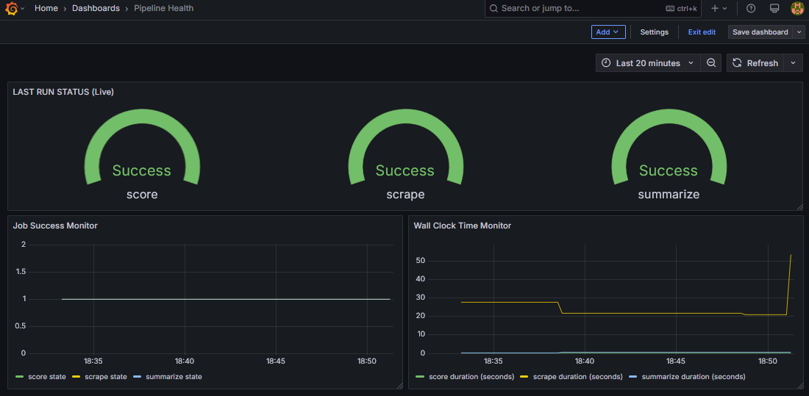
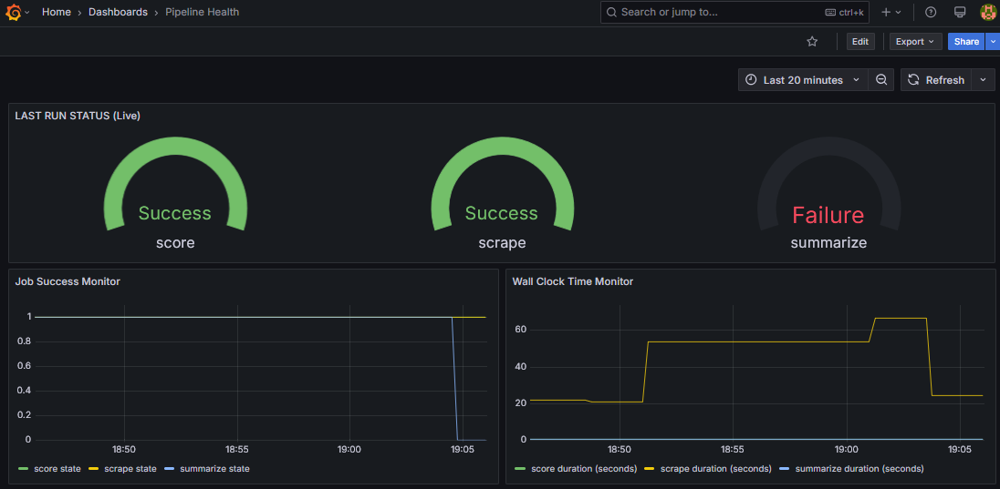

# Reddit Sentiment Pipeline

[](https://github.com/halstonblim/reddit_sentiment_pipeline/actions/workflows/daily.yml)
[](https://redditsentimentpipeline.streamlit.app/)

A fully‑automated **end‑to‑end MLOps** pipeline that tracks daily sentiment trends on Reddit, scores posts with a transformer‑based model served from Replicate, summarizes the results, and publishes an interactive Streamlit dashboard—all orchestrated by GitHub Actions.

***Analyzing the Public Discourse of AI News***

The pipeline is currently configured in `config.yaml` to analyze AI news discourse across `r/articial`, `r/LocalLLama`, `r/singularity`, and `r/OpenAI`. The data is persisted across three steps
1. **Scrapes** new submissions from a configurable list of subreddits (→ `data_raw/`)
2. **Classifies** each post with a sentiment model served on Replicate (→ `data_scored/`)
3. **Summarises** daily trends for lightweight front-end consumption (→ `daily_summary/`)

More information on the data can be found on the Hugging Face Dataset repo [hblim/top_reddit_posts_daily](https://huggingface.co/datasets/hblim/top_reddit_posts_daily)

***Sentiment Analysis*** 

We use the [DistilBERT sentiment analysis model](https://github.com/halstonblim/batch-bert-sentiment), which is wrapped with Cog for easy deployment on Replicate. The model handles batched input texts in a single API call, which improves performance by parallelizing computation on the GPU.

---

## Table of Contents
1. [Project Structure](#project-structure)
2. [Installation & Quick start](#installation)
3. [Configuration](#configuration)
4. [Back-end reddit_analysis](#backend-reddit-analysis)
5. [Unit tests](#unit-tests)
6. [Front-end Streamlit](#front-end-streamlit)
7. [CI/CD & GitHub Actions](#cicd-github-actions)
8. [Monitoring with Grafana/Prometheus](#monitoring-with-grafanaprometheus)
9. [Extending / Customising](#extending--customizing)

---

## Project Structure

````text
reddit_sentiment_pipeline/
├── reddit_analysis/               # Back‑end
│   ├── __init__.py
│   ├── scraper/
│   │   └── scrape.py              # Collect raw posts → HF dataset (data_raw)
│   ├── inference/
│   │   └── score.py               # Call Replicate model → adds sentiment scores
│   ├── summarizer/
│   │   └── summarize.py           # Aggregate + export CSV summaries (data_scored)
│   ├── config_utils.py            # Secrets & YAML helper
│   ├── tests/                     # Pytest test-suite
|
├── streamlit_app/                 # Front‑end
│   └── app.py
│
├── .github/
│   └── workflows/
│       ├── daily.yml              # Cron‑triggered ETL + summarize
│
├── config.yaml                    # Default runtime config (subreddits, models …)
├── requirements.txt               # requirements for front end only
├── requirements-dev.txt           # requirements for local development
└── README.md
````

### Automated Workflow
```
[GitHub Actions Cron @ 21:00 UTC]
          |
          v
  +-------+-------------+
  |    Scrape Reddit    |  ← `scraper/scrape.py --date $DATE`
  +-------+-------------+
          |
          v
  +-------+-------------+
  |  Sentiment Analysis |  ← `inference/score.py --date $DATE`
  +-------+-------------+
          |
          v
  +-------+-------------+
  |      Summarize      |  ← `summarizer/summarize.py --date $DATE`
  +-------+-------------+
          |
          v
  [HF Dataset: data files]  
          |
   Frontend (Streamlit app)
          |
   Public URL (Streamlit Cloud)
```

---

## Installation

To run the frontend streamlit app locally

```bash
git clone https://github.com/halstonblim/reddit_sentiment_pipeline.git
cd reddit_sentiment_pipeline
pip install -r requirements.txt
streamlit run frontend/app.py
```

To run the backend reddit analysis locally and set up your own scraper, sentiment analysis, and export pipeline, steps are roughly
- Get Reddit/Hugging Face/Replicate accounts and API tokens 
- You must configure a .env with the secrets (HF, Replicate, Reddit tokens)
- Configure the .yaml file to point to the proper Hugging Face repository and Replicate models, and subreddits to scrape

Once those are configured you can run the following which should scrape Reddit, analyze text remotely with a Replicate model, and export results to Hugging Face

```bash
pip install -r requirements-dev.txt

# Run the full pipeline for today
$ python -m reddit_analysis.scraper.scrape    --date $(date +%F)
$ python -m reddit_analysis.inference.score  --date $(date +%F)
$ python -m reddit_analysis.summarizer.summarize --date $(date +%F)
```
---

## Configuration

All non‑secret settings live in **`config.yaml`**; sensitive tokens are supplied via environment variables or a `.env` file.

```yaml
# config.yaml (excerpt)
repo_id: hblim/top_reddit_posts_daily
push_to_hf: true
subreddits:
  - name: apple
    post_limit: 100
    comment_limit: 5
```

| Variable | Where to set | Description |
|----------|-------------|-------------|
| `HF_TOKEN` | GitHub → *Settings › Secrets and variables* <br>or local `.env` | Personal access token with **write** permission to the HF dataset |
| `REPLICATE_API_TOKEN` | same | Token to invoke the Replicate model |
| `ENV` | optional | `local`, `ci`, `prod` – toggles logging & Streamlit behaviour |

---

## Backend reddit analysis

### 1. `scraper.scrape`
Collects the top *N* daily posts from each configured subreddit and appends them to a [Hugging Face **Parquet** dataset](https://huggingface.co/datasets/hblim/top_reddit_posts_daily/tree/main/data_raw) (`data_raw`).

```bash
python -m reddit_analysis.scraper.scrape \
       --date 2025-04-22           # YYYY‑MM‑DD (defaults to today)
       --limit 100                 # optional, posts/subreddit
       --overwrite                 # re‑upload if already exists
```

* **Dependencies:** [`praw`](https://praw.readthedocs.io/), `huggingface‑hub`
* **De‑duplication:** handled server‑side via dataset row `post_id` as primary key—**no local state needed**.

---

### 2. `inference.score`
Downloads one day of raw posts, sends raw text consisting of `title + selftext` to the **Replicate** hosted model in batches for optimized parallel computation, and pushes a scored Parquet file to a separate [Hugging Face **Parquet** dataset](https://huggingface.co/datasets/hblim/top_reddit_posts_daily/tree/main/data_scored) `data_scored`.

```bash
python -m reddit_analysis.inference.score \
       --date 2025-04-22 \
       --model your‑org/sentiment‑model:latest \
       --batch_size 64            # Replicate parallelism
```

* **Retry logic:** automatic back‑off for `httpx.RemoteProtocolError`.
---

### 3. `summarizer.summarize`
Aggregates daily sentiment by subreddit (mean & weighted means) and writes a compact CSV plus a Parquet summary.

```bash
python -m reddit_analysis.summarizer.summarize \
       --date 2025-04-22 \
       --output_format csv parquet
```

* **Uses `pandas` `groupby` (no default sorting—explicitly sorts by date + subreddit).**
* **Exports** are placed under `data_summary/` in the same HF dataset repo.

---

## Unit tests

The backend test‑suite lives in `reddit_analysis/tests/` and can be executed with **pytest**:

```bash
pytest -q
```

| File | What it tests | Key fixtures / mocks |
|------|--------------|----------------------|
| `tests/scraper/test_scrape.py` | Reddit fetch logic, de‑duplication rules | `praw.Reddit`, `huggingface_hub.HfApi` mocked via `monkeypatch` |
| `tests/inference/test_score.py` | Batching, error handling when HF token missing | Fake Replicate API via `httpx.MockTransport` |
| `tests/summarizer/test_summarize.py` | Correct aggregation & sorting | `pandas` dummy frames |

CI runs the tests on every push (see [daily.yml](#cicd--github-actions)).

---

## Front end (Streamlit)

`streamlit_app/app.py` provides an interactive dashboard that:
1. Downloads the daily summary CSVs from HF.
2. Displays time‑series sentiment trends, top posts tables, and subreddit post counts.
3. Allows filtering by date range or subreddit with responsive Altair charts.

```bash
# Local preview
streamlit run streamlit_app/app.py
```
---

## CI/CD Github Actions

### `.github/workflows/daily.yml`


| Step | What it does |
|------|--------------|
| **Setup** | Checkout repo, install Python 3.12, cache pip deps |
| **Scrape** | `python -m reddit_analysis.scraper.scrape --date $DATE` |
| **Score** | `python -m reddit_analysis.inference.score --date $DATE` |
| **Summarize** | `python -m reddit_analysis.summarizer.summarize --date $DATE` |
| **Tests** | `pytest -q` |

*Trigger:* `cron: "0 21 * * *"` → 4 pm America/Chicago every day.

Secrets (`HF_TOKEN`, `REPLICATE_API_TOKEN`) are injected via **repository secrets** so the workflow can push to Hugging Face and call Replicate. The runner is completely stateless—every job starts on a fresh VM and writes data only to external storage (HF dataset).

---

## Monitoring with Grafana/Prometheus

Implemented a local lightweight Prometheus + Grafana stack; each pipeline stage pushes job_success and job_duration_seconds metrics. Dashboard surfaces run health & latency trends.

Example of success state:



Example of failure state:



--

## Extending / Customizing

* **Change subreddits** – edit the list in `config.yaml` or pass `--subreddits` to the scraper.
* **Swap sentiment models** – point `replicate_model` to any text‑classification model on Replicate with single‑sentence input.
* **Augment summaries** – create additional aggregator modules (e.g. keyword extraction) and add a new step in `daily.yml`.

